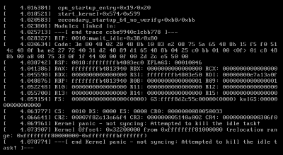

# Linux VirtualBox installing to Windows11
Noticed when you install Linux VirtualBox to Windows 11

# Linux VirtualBoxin asentaminen Windows 11
## Huomioitavaa, kun asennat Windows 11 koneeseen VirtualBox

Tämä kuuluu kurssiin  Configuration Management Systems - Palvelinten Hallinta ict4tn022-3018 - syksy 2022

Tarkista koneen tekniset tiedot, että prosessori on Linuxia tukeva ja muisti riittää. Linuxissa on sellaisia versioita, joita pystyy pienillä muistimäärillä pyörittämään. Jos asennus tapahtuisi pääkäyttöjärjestelmäksi pystyisi jättämään asennuksista jotain osioita pois. VirtualBoxin pääset asentamaan täältä https://www.virtualbox.org/

## Asennuksen ongelmat ja siihen ratkaisut

Odotettavissa on, että asennus näyttää onnistuvan siihen saakka, kunnes käynnistät VirtualBoxin. Virheilmoitus on luultavasti 'Kernel' panic, jonka näet alla.

