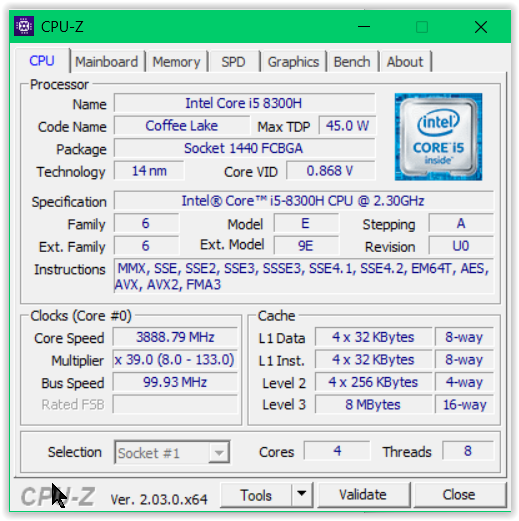
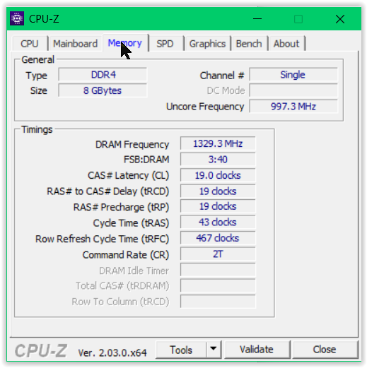
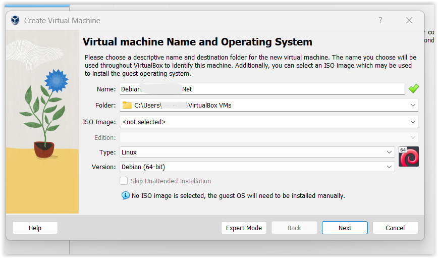
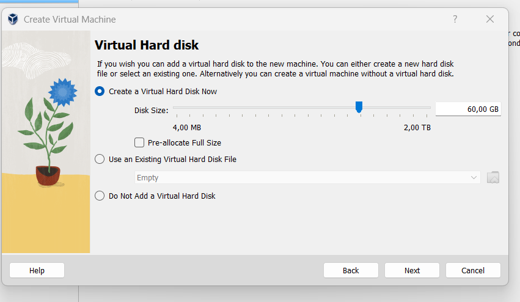
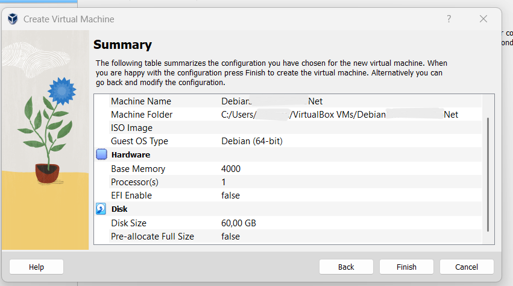
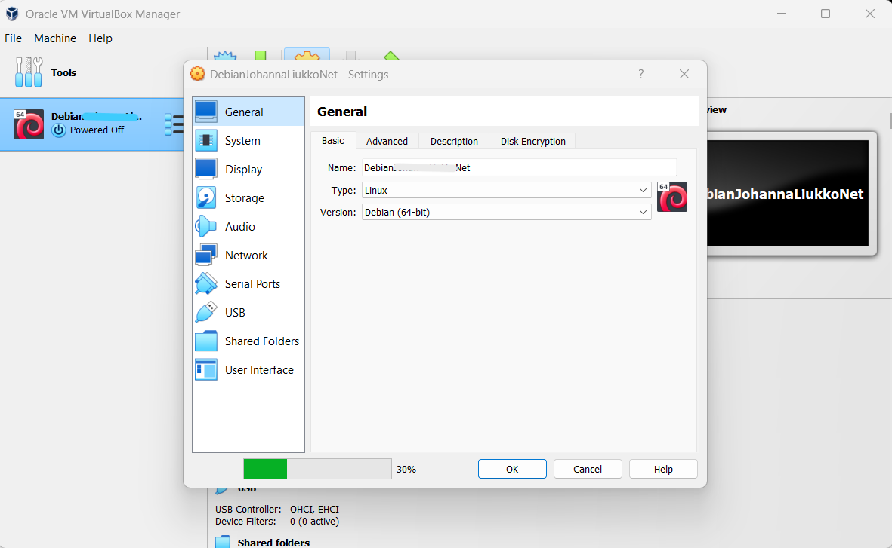
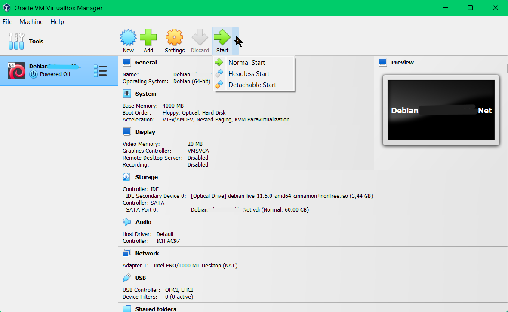
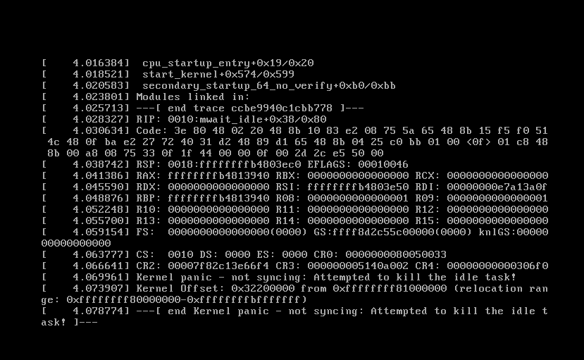
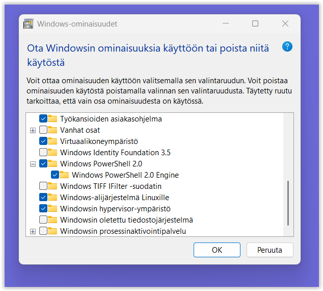

Tämä kuuluu kurssiin Configuration Management Systems - Palvelinten Hallinta ict4tn022-3018 - syksy 2022 https://terokarvinen.com/2022/palvelinten-hallinta-2022p2/

<i>Aloitettu 27.10.2022</i>

<h2>Esivalmistelut ennen käyttöönottoa</h2>

Tarkista koneen tekniset tiedot, että prosessori on Linuxia tukeva ja muisti riittää. Linuxissa on sellaisia versioita, joita pystyy pienillä muistimäärillä pyörittämään. Jos asennus tapahtuisi pääkäyttöjärjestelmäksi pystyisi jättämään asennuksista jotain osioita pois. Halusin käyttää Windows 11 koneella rinnakkain virtuaalista Linuxia. CPU-Z:llä katsoin tarkemmat koneeni spekseistä, jotta varmasti koneeni olisi yhteensopiva valmitsemani Linux-sovelluksen kanssa.

Virtualbox tuli asentaa, jotta pystyisin käyttämään Linuxia ns. aidossa ympäristössä. VirtualBoxin löytää täältä ladattavaksi https://www.virtualbox.org/ Sivuilla kerrotaan sopivan eri Windowsseille, mutta Windows 11 ei ollut mainintaa. Heti etusivuilta löytyy nappi, josta pääsee lataussivuille. Kirjoittaessani tätä raporttia VirtualBox 7.0.2 oli uusin. Jokaiselle käyttöjärjestelmälle on oma tiedostonsa ja klikkaamalla Windows hosts linkkiä ponnahtaa ikkuna, jolla saa tiedoston tallennettua koneelle. Latauksen jälkeen etsin tiedoston ja klikkasin sitä kahteen kertaan, jolloin asentaminen alkaa.

## Asennus

Olin Johdanto ICT-infrastruktuuriin ja pilvipalveluihin - ICI001IT1A-3022 -kurssilla, jonka materiaaleista löytyy ohje "Ubuntun asentaminen VirtualBox:n avulla". Ohje on suomen kielinen. Koska virtuaalisen Linuxin asentaminen jäi kiireen vuoksi tekemättä oli se nyt edessä. Asennus alkoi hyvissä merkeissä, kuten seuraavista kuvista huomataan. Kunnes sarjan viimeisessä kuvassa näkyy virheilmoitus: Kernel panic.

Poistin VirtualBoxin, sillä mielessä kävi jos asennuksessa joku oli pieleen. Sama juttu seuraavallakin kerralla ja parin päivän aikana, jolloin googlasin ja hakkasin päätäni seinään yrittäessäni löytää ongelmaan ratkaisua. Ehdotuksia löytyi niin palomuurin poispäältä ottamisesta ja sinne asetuksien muuttamisesta. Myös Windowsin ominaisuuksia pyydettiin ottamaan käyttöön. Koneessani ei ollut rastitettuna virtuaalikoneympäristö, Windows-alijärjestelmä Linuxille eikä Windowsin hypervisor-ympäristö, joten rastitin ne ja toivoin, että korjausliike auttaa VirtualBoxin käynnistymiseen.

Edelleen kernel panikoitui ja niin aloin itsekin panikoitumaan. Epätoivo puski jo päälle ja 4-5 päivän jälkeen annoin periksi. Odotin masentuneena seuraavan kurssipäivän saapumista ja mietin, miten ratkaista asia.

## Ratkaisu

Kurssipäivä saapui ja kerroin tilanteestani sekä kernelin paniikista. Joku kurssikavereista vinkkasi tätä linkkiä https://forums.virtualbox.org/viewtopic.php?f=6&t=105926. Mielestäni olin tällä saitilla käynyt, mutta en löytänyt tuota ja sielläpä se ratkaisu oli kirjoitettuna: laita asennuksessa kaksi (2) prosessoria yhden (1) sijaan! Nyt VirtualBox meni heittämällä ja ongelmitta koneelle sekä Ubuntun.

#### <i>Päivitys 10.11.2022</i>

Kokeilin varmuuden vuoksi tehdä uuden irtuaalisen Linux-pohjan asentamalla Debianin kahdella prosessorilla eikä ollut mitään ongelmia. Katselin ihaillen asennuksen etenemistä samalla kuin keräsin tietoa lisää oppitunnilta.

LÄHTEET

https://www.virtualbox.org/wiki/Technical_documentation
https://forums.virtualbox.org/viewtopic.php?f=6&t=105926
https://blogs.oracle.com/virtualization/post/install-microsoft-windows-11-on-virtualbox

Ja muut lukuisat Google saitit, joita ei tullut otettua talteen sattuneesta syystä
